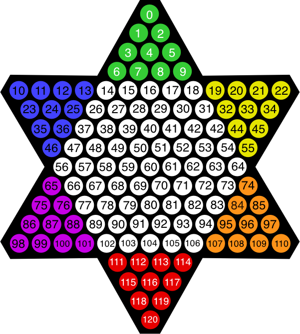

# Chinese Checkers
Chinese checkers (US and Canadian spelling) or Chinese chequers (UK spelling) is a strategy board game of German origin (named "Sternhalma") which can be played by two, three, four, or six people, playing individually or with partners. The game is a modern and simplified variation of the game Halma.

The objective is to be first to race all of one's pieces across the hexagram-shaped board into "home"—the corner of the star opposite one's starting corner—using single-step moves or moves that jump over other pieces.

## Getting Started
Using Python 3 create a virtual environment with the following command:

    $ python3 -m venv venv

Now you have to tell the system that you want to use it, and you do that by activating it. To activate your brand new virtual environment you use the following command

    $ source venv/bin/activate
    (venv) $ _

When you activate a virtual environment, the configuration of your terminal session is modified so that the Python interpreter stored inside it is the one that is invoked when you type python. Also, the terminal prompt is modified to include the name of the activated virtual environment. The changes made to your terminal session are all temporary and private to that session, so they will not persist when you close the terminal window. If you work with multiple terminal windows open at the same time, it is perfectly fine to have different virtual environments activated on each one.

Now that you have a virtual environment created and activated, you can finally install project dependencies:

    (venv) $ pip install -r requirements.txt

Now yout can start the game:

    (venv) $ python3 app.py 

To start server name:

    python -m Pyro4.naming

To print server name list 

    python -m Pyro4.nsc list

## Game Board

